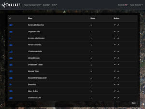

<!--ts-->
* [Oxalate portal user documentation](#oxalate-portal-user-documentation)
   * [Anonymous](#anonymous)
      * [Registering](#registering)
      * [Logging in](#logging-in)
      * [Forgotten password](#forgotten-password)
   * [User](#user)
      * [Dive events](#dive-events)
         * [Upcoming and currently running dive events](#upcoming-and-currently-running-dive-events)
         * [Past dive events](#past-dive-events)
         * [Yearly dive statistics](#yearly-dive-statistics)
      * [Selected pages](#selected-pages)
      * [Profile](#profile)
         * [Update profile](#update-profile)
         * [Password change](#password-change)
   * [Organizer](#organizer)
      * [Limited page management](#limited-page-management)
      * [Create dive events](#create-dive-events)
      * [Access to user information](#access-to-user-information)
   * [Administrator](#administrator)

<!-- Created by https://github.com/ekalinin/github-markdown-toc -->
<!-- Added by: poltsi, at: Sun Jan 28 02:19:18 PM EET 2024 -->

<!--te-->

# Oxalate portal user documentation

The Oxalate Portal allows users to have different roles which means that they have different action permissions. The documentation is split into the following
sections based on roles as the UI experience will differ for each of these:

* [Anonymous](#Anonymous)
* [User](#User)
* [Organizer](#Organizer)
* [Administrator](#Administrator)

## Anonymous

This is any person browsing the portal without being logged in. The portal will allow anonymous users to view certain pages such as the front page and any other
page that allows anonymous to read it. In addition the anonymous can register and login.

The anonymous will also be able to choose in which language the portal should be displayed. This is done by clicking on the language selector in the top right.

### Registering

To register, the anonymous user can click on the register button in the top right corner. This will take the user to the registration page where the user can
register by filling in the form.

A functional email is used as the username and a password is required. The password must be at least 10 characters long and contain at least one uppercase
letter, one lowercase letter, one number and one special character. The user must also agree to the terms and conditions.

Once the user has filled in the form, the user can click on the register button to register. If the registration is successful, the user will be informed of
this and informed about the next step which is to verify the email address.

In case the confirmation email was not sent, the user has the option to resend the confirmation email by clicking on the provided button. 3 attempts are
allowed.

A confirmation email is sent to the user with a link to confirm the email address. The user must click on the link to confirm the email address.

This will take the user back to the portal where the user will be informed that the email address has been confirmed.

The user can now go to the login page to authenticate.

### Logging in

Once logged in, the user assumes one of the following roles:

* [User](#User)
* [Organizer](#Organizer)
* [Administrator](#Administrator)

### Forgotten password

In the login page there is a button to reset the password if the user has forgotten it. Clicking on this button will take the user to the forgotten password page.

The user can enter the registered email address and click on the reset password button.

If the email address is valid, the user will be informed that an email has been sent to the email address.

Clicking on the link in the email will take the user to the reset password page.

Entering the new password and clicking on the update button will reset the password.

The user can now go to the login page to authenticate.

## User

A newly registered user will be assigned the user role. This role grants access to the following parts:

### Dive events

The user can browse the dive events and register for them. The user can also see what past events has been arranged as well as who are the most prolific
divers.

#### Upcoming and currently running dive events

The user can view the upcoming and currently running dive events with their main characteristics such as date, duration of event, type of diving, maximum
dive time / depth allowed and who the organizer is. The user can then register for the dive event by opening the details view and clicking on the
Participate button.

In a similar way, the user can also unregister from the dive event by opening the dive event details view and clicking on the Remove button.

By default, unless the event is a surface-only type, each participating diver is allotted one dive. This number can be altered by the organizer during the
event according to how many dives the diver as performed.

#### Past dive events

The user can also browse, and search, past events.

The user can see the main characteristics of the past events such as date, duration of event, type of diving, maximum dive time / depth allowed and who the
organizer was.

The details of the event is also available user can also see how many dives each participants performed during the event.

#### Yearly dive statistics

The portal allows the user to see the yearly dive statistics for each year. The list shows the top 100 divers with most dives for the year.

### Selected pages

The portal supports the possibility for the administrators to create custom page groups and pages that the user can access. These page and page groups are
visible in the navigation menu.

### Profile

Final menu contains links for the user to access the profile page as well as password change and logout link.

#### Update profile

The profile page contains a form that allows the user to update their information as well as lock or anonymize their account.

Locking the account will freeze it and the only way to unlock it is by requesting an administrator to unlock it.
Anonymizing the account will remove all personal information as per the GDPR from the account and the account will be locked. Note that the account still exist
and show up in all the dive event lists and statistics but the personal information is removed.

The profile page is also where the user can add and manage dive certifications.

When the user clicks on the Add a new certificate button, a form is displayed where the user can enter the certificate information.

The user can also edit existing certificates in case of errors or changes. And the user can also delete certificates if they become obsolete (as they're
superseded by new certificates).

Last part in the profile page is the list of upcoming events the user has registered for and a separate list of past events the user has taken part in. These
lists contain a link to the event details page.

#### Password change

This is the same form as the forgotten password form with the distinction that the user can enter the current password and the new password and click on the
update button to change the password.

## Organizer

An event organizer is a diver that has the competence to arrange events on the dive site. In the portal this is represented by the organizer role. In
addition to the [User](#User) role, the organizer role grants access to the following parts:

### Limited page management

The link in the navigation menu will take the organizer to the page group management page where the organizer can see a list of existing page groups.

Only administrators can manage page groups. Organizer can add pages to existing page groups as well as edit those pages to which they have access.
Note that there is a special page group called "Reserved" which is accessible only to administrators. The pages in this group are dedicated to specific
functionality such as the content of the front page and the terms and conditions page.

In order to add or edit an existing page, the organizer must click on the Update pages button. In the new view the list of pages belonging to the page group
is displayed. The list also shows the access permissions for each page. The organizer can add new pages by clicking on the Add a new page button.

In order for the organizer to have edit permission on a page, the page must have write-permission set to true.

On the bottom of the list of pages, there is a button to add a new page. Clicking on this button will take the organizer to the page form.

Most fields in the form are self-explanatory and have a tooltip which explains their function.
The form allows the organizer to enter the page title, the ingress and the page content in all supported languages. The text of the page has rudimentary
support for formatting. Note that the editor can not remove the read and write permissions of their own role. This is in order to prevent the organizer from
creating pages that they can not then edit later. By default the anonymous role has read permission on all pages. If the page is not meant to be accessible
to anonymous users, the organizer must remove the anonymous role permission.

Once the organizer has filled in the form, the organizer can click on the Create new page button to save the page and the result will be displayed.

Clicking on the Back button will take the organizer back to the page list. If the organizer added a new page, then it will be displayed here.

### Create dive events

For the organizer, the Events menu in the navigation bar also shows a link to the create event page. Clicking on this link will take the organizer to the
create event page.

The fields have all tooltips that explain their function. The organizer can assign the event to another organizer as well as divers that will participate
in the event.

If the event is not yet ready to be published, then there is a switch to keep it from being shown publicly. Once the organizer is ready to save the event,
the organizer can click on the Add event button and the result will be displayed.

Clicking on the Back button will take the organizer to the front page. If the organizer added a new event and made it public, then it will be displayed in
the upcoming events.

Note in the list view that the organizer also has the option to edit the event. Clicking on the Update button will take the organizer to the edit event page.

Here the organizer can edit the event and save the changes by clicking on the Update event button. If the event is cancelled, then the organizer can remove
the public status of the event as well as remove any participants from the event.

If the organizer edits an ongoing event, then there is an additional button on the bottom of the page for updating the number of dives each participant has
done. This button is available during the dive event. Clicking on this button will take the organizer to the dive count update page.

The form lists all participants *including the organizer* and the organizer can adjust the number of dives each participant has done with the arrow up/down on
the right. The organizer stores the updated number of dives by clicking on the Save button after which the updated dive counts are displayed. The Back button
takes the organizer back to the edit event page.

### Access to user information

The organizer has additional permission to view any user detail. This access is in the portal UI in the form of link to the user information where the user
is listed as a participant.

The organizer can view the user details such as payment status, certificates, number of dives, contact information of all users. This is in order to be
able to verify that the user has the required competence to participate in the event as well as to be able to contact the user in case of changes to the
event or next of kin in case of an accident. This will override the user's privacy settings.

## Administrator

